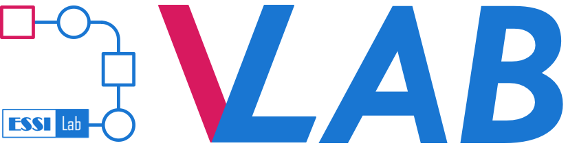

<!-- PROJECT LOGO -->
 

  

<h3 align="center">Virtual Earth Laboratory (VLab) Community Edition (CE)</h3>

This repository publishes the open source code of the VLab CE. The CE provides all stable and consolidated functionalities of the VLab.

VLab is a software framework orchestrating data and model access to implement scientific processes for knowledge generation. The VLab lowers
the entry barriers for both developers and users. It adopts mature containerization technologies to access models as source code and to
rebuild the required software environment to run them on any supported cloud. This makes VLab fitting in the multi-cloud landscape, which is
going to characterize the Big Earth Data analytics domain in the next years. The VLab functionalities are accessible through APIs, enabling
developers to create new applications tailored to end-users.

## Pre-requisites

In order to run the VLab CE the following pre-requisites must be satisfied:

- Access (with read/write privileges) to an RDF repository supporting SPARQL
- Access (with read/write privileges) to a message queue service supporting either AWS SQS or KubeMQ APIs
- Access (with read/write privileges) to a JSON-based repository supporting Elasticsearch APIs
- Access (with read/write privileges) to a Web Storage service supporting S3 APIs
- Access (with read/write privileges) to a shared hard drive supporting NFS v4.0 or higher

(<a href="#top">back to top</a>)

## Functionalities

The current CE supports the following high-level functionalities:

- Execution of models on single cluster
- Support of AWS ECS and Kubernetes container orchestration environment for model execution
- Web APIs
- Automatic swagger documentation generation
- Input ingestion from URL
- Support of Sentinel (1 and 2) product download from Copernicus Open Access Hub
- Support of model parameters
- Support of source code retrieval from public Git repositories
- Support of docker images retrieval from public Docker repositories

(<a href="#top">back to top</a>)

## Configuration and Deployment

The VLab CE deployment is composed of two artifacts:

- A service artifact, which is packaged a a WAR file
- A controller artifact, which packaged as a JAR file

To obtain the artifacts, run the following maven command from the root of this repository:

mvn clean package -P jar-with-dep

The service is in charge of publishing the Web APIs and implement them. The controller is in charge orchestrating the model executions. The
service can be deployed on any Java web application server (e.g., tomcat, jetty, etc.). The controller should be scheduled for execution at
regular intervals and must run on the same cluster where models are executed. Both service and controller read configuration values from the
following locations (in the provided order):

- Environment Variable
- Configuration file (located at src/main/resources/vlab.properties)

Following releases will provide YAML files for the configuration and deployment of service and controller artifacts on Kubernetes cluster.

(<a href="#top">back to top</a>)

## License and attribution

While the VLab community edition code is **open source**, it is not a **public domain software**. Therefore, to use the VLab source code you
should **give full attribution to the original authors** and **redistribute your modifications** in the same way, accordingly to the **GNU
Affero General Public License v3.0** (see LICENSE). To know more about how to correctly utilize the VLab open source code and provide
appropriate attribution, please, select the relevant cases:

	
To use the VLab technology for providing online services

 

AGPL license is more restrictive with respect to GPL with regard to online service providers making use of the licensed software.

This is the case where a third party downloads the VLab source code and offers its functionalities through an online service (e.g. through a
server managed by the third party). In this case **the following statement should appear at the third party site** offering the service:

<code>The model/workflow orchestration service is offered by Virtual Earth Laboratory (VLab), a software developed by National Research
Council of Italy (CNR)/Institute of Atmospheric Pollution Research (IIA)/ESSI-Lab. More information is available
at https://github.com/ESSI-Lab/VLab/ </code>

To use the VLab technology for a scientific and/or technological publication

 

Please note at least **one of the following papers should be cited to give correct author attributions** while describing work making use of
the VLab:

<code><a href="https://doi.org/10.3390/rs12111795">Santoro M, Mazzetti P, Nativi S. The VLab Framework: An Orchestrator Component to Support
Data to Knowledge Transition. Remote Sensing. 2020; 12(11):1795. https://doi.org/10.3390/rs12111795</a> </code>

	
To start a new branch of the VLab software

 

The modified source code should be licensed according to AGPL and **redistributed back to the community, preferably through the VLab GitHub
repository**. You are welcome and encouraged to <a href="#contact-essi-lab">contact ESSI-Lab</a> to propose code contributions to be applied
to the present repository (see contributions section).

In any case the following attribution headers should be preserved in modified versions of the source code:

<codeVirtual Earth Laboratory (VLab) Community Edition (CE)</code>

<code>Copyright (C) 2021 National Research Council of Italy (CNR)/Institute of Atmospheric Pollution Research (IIA)/ESSI-Lab</code>

In case a modified version of the VLab is offered by a third party as an Internet service, in addition to the attribution described above,
also the code (or a link to the VLab GitHub repository holding the modifications) should be made available on the third party site.

	

(<a href="#top">back to top</a>)

## Contributions

	
How to contribute to this project

 

Contributors to the ESSI-Lab VLab CE project are welcome: you can **report bugs and request enhancements** <a href="#contact-essi-lab">
contacting ESSI-Lab</a> or through the GitHub issue tracker.

To **propose code contributions** please <a href="#contact-essi-lab">contact ESSI-Lab</a> to coordinate the development effort and avoid
duplications.

The <a href="https://gist.github.com/ESSI-Lab/68833fd7d9896513ae95a575695a85a2">ESSI-Lab Contributor License Agreement</a> (based on
HA-CLA-I-OSI) needs to be signed by contributors to enable ESSI-Lab to accept community contributions to the VLab repository even more
smoothly. Now the signature of the agreement is fully integrated in the Github pull request.

If you're interested in contributing, please take a look as well
at <a href="https://raw.githubusercontent.com/ESSI-Lab/DAB/main/CODE_OF_CONDUCT.md">ESSI-Lab's Contributor Code of Conduct</a>.

(<a href="#top">back to top</a>)

## VLab history and acknowledgments

	
Learn more about the VLab history and the main contributors

 

VLab was first conceived and is still maintained and advanced by the [ESSI-Lab](https://essi-lab.eu) based at
the [Florence division](https://iia.cnr.it/sede-firenze/) of the [Institute of Atmospheric Pollution Research (IIA)](https://iia.cnr.it/)
of [National Research Council of Italy (CNR)](https://www.cnr.it/).

### Projects

The VLab software has been developed in the context of several international projects and initiatives, which have been funded and/or
operated by different organizations, including:

<ul>
<li>Horizon 2020 ECOPOTENTIAL</li>
<li>Horizon 2020 EOSC-Hub</li>
<li>Horizon 2020 ERA-PLANET</li>
<li>ESA DAB4EDGE</li>
<li>ESA DAB4GPP</li>
<li>H2020 I-CHANGE</li>
<li>HE TRIGGER</li>
</ul>

### Contributors

[VLab development team (contact us)](https://www.uos-firenze.essi-lab.eu/personnel):

- Stefano Nativi (sofware design)
- Paolo Mazzetti (sofware design)
- Mattia Santoro (software design, lead-developer)
- Enrico Boldrini (developer)
- Fabrizio Papeschi (developer)
- Roberto Roncella (developer)
- Massimiliano Olivieri (system adiministrator)

(<a href="#top">back to top</a>)

## Contact ESSI-Lab

You are welcome to contact us for any info about the VLab, including bug reports, feature enhancements and code contributions.

[http://essi-lab.eu/](http://essi-lab.eu/)

[info@essi-lab.eu](info@essi-lab.eu)

GitHub repository link: [https://github.com/ESSI-Lab/VLab](https://github.com/ESSI-Lab/VLab)

(<a href="#top">back to top</a>)

